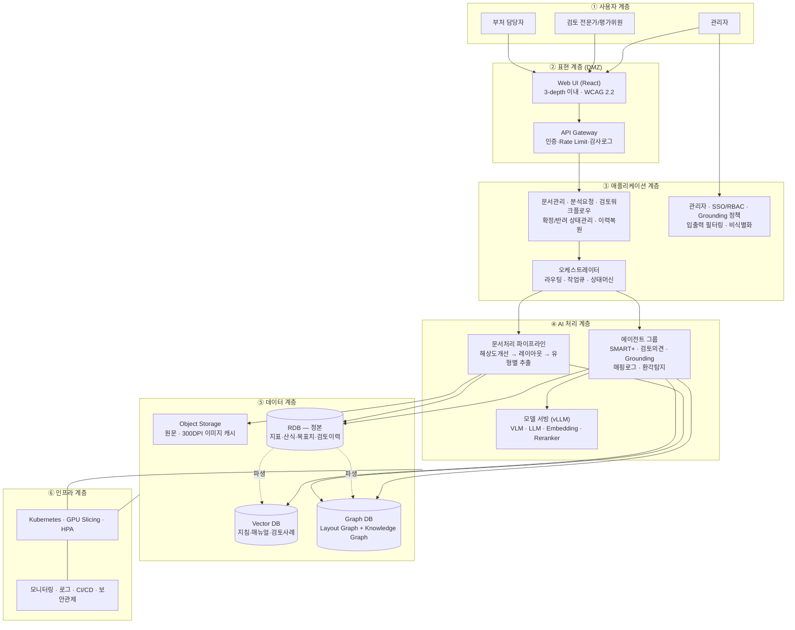
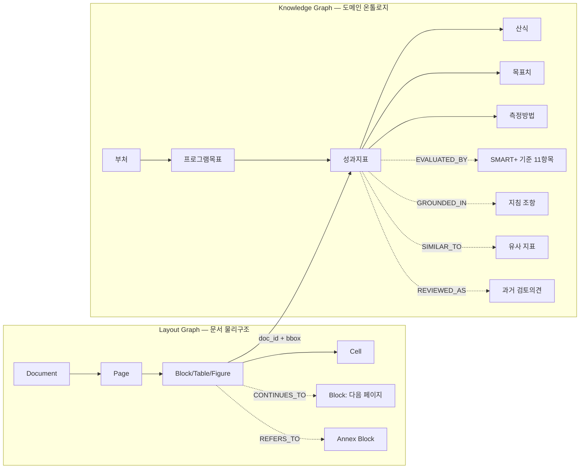
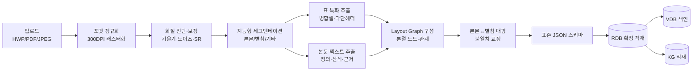
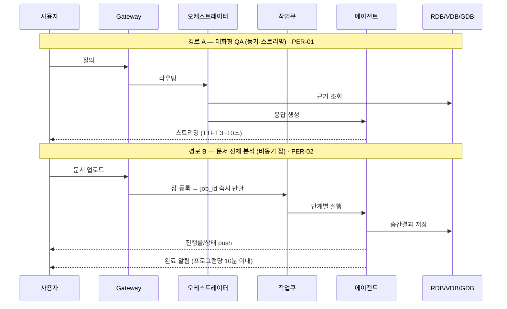
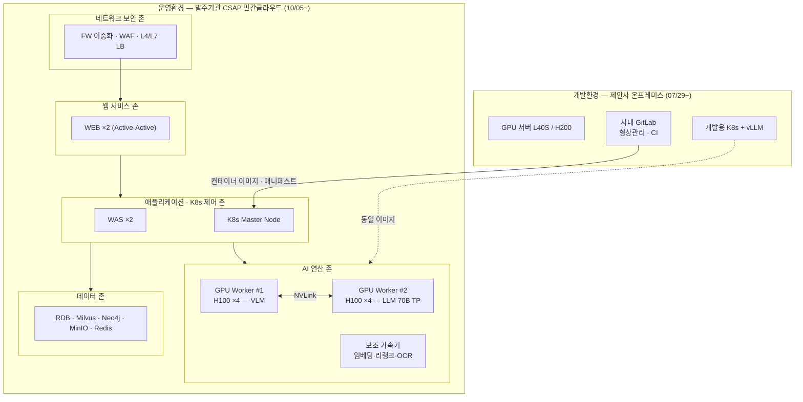

# 2026년 재정성과관리 AI 구축 — 전체 시스템 아키텍처 설계서 (v0.1)

**작성 근거** · RFP(제안요청서 수정본, 요구사항 46건) / 정성제안서 v0.992 / WBS v0.9(AI엔지니어링팀, 2026.07.22 ~ 12.21, 총 1,032 M·D)
**산출물 대응** · WBS 2.1.2.1 「시스템 아키텍처(초안) 설계」 (07/27~07/29, 6 M·D)

---

## 0. 설계 전제 (Assumption)

WBS가 명시적으로 채택한 전제이며, 착수보고(07/28) 시 발주기관 확인이 필요하다.

| # | 전제 | 근거 | 확정 필요도 |
|---|---|---|---|
| A1 | **개발환경**은 제안사 자체보유 온프레미스 GPU(L40S/H200), **운영환경**은 발주기관이 별도 사업으로 제공하는 CSAP 민간클라우드 | WBS 2.2.1 / 2.2.2, RFP 제안요청사항 "발주사에서 민간클라우드 인프라 구축 사업을 별도 추진 예정" | **높음** — CSR-01 BOM은 클라우드 비용을 본 사업 예산에 포함한다고 기술하여 상충 |
| A2 | 운영 GPU는 H100 × 8장 (VLM 4 / LLM 4), 워커노드 2대 구성 | RFP CSR-01 BOM, CSR-02 | 중 |
| A3 | Vector DB는 **Milvus**, Graph DB는 **Neo4j** 계열 | WBS 2.5.1.1.1 / 2.5.2.1.1 | **높음** — RFP SFR-04는 Weaviate를 명시 |
| A4 | dBrain 연계는 **발주기관 제공 데이터(파일/추출본) 기준**, 실시간 API 연계는 범위 외 | RFP 인터페이스 요구사항(SIR)에 대외연계 항목 부재 | **높음** |
| A5 | 학습·평가용 원천 데이터(성과계획서 원본, 과거 전문가 검토의견)는 08월 중 발주기관이 제공 | WBS 2.1.1.4 / 2.1.1.5 / 2.3.1.1 | **높음** — 미제공 시 2.3 이후 전 공정 정지 |

---

## 1. 아키텍처 원칙

1. **RDB 정본(Single Source of Truth)** — 문서에서 추출·정제·표준화된 성과지표 데이터는 RDB에 먼저 확정 적재하고, VDB·GDB는 이로부터 **파생(derived projection)** 한다. 재색인·재적재가 항상 RDB에서 재현 가능해야 한다. *(WBS 2.3.4.1 "VDB/GDB 구축의 기준 데이터셋")*
2. **두 개의 그래프를 분리한다** — 문서 레이아웃 구조를 잇는 **Layout Graph**(WBS 2.4.3)와 도메인 온톨로지 기반 **Knowledge Graph**(WBS 2.5.2)는 목적·수명주기가 다르므로 물리적으로 분리하고, `doc_id + bbox`로만 연결한다.
3. **근거 없는 출력 금지(Grounding-by-construction)** — 모든 LLM 출력은 구조화 데이터(JSON) + 근거 좌표(page, bbox)를 함께 반환하며, 근거를 부여할 수 없는 응답은 생성 단계가 아니라 **응답 조립 단계에서 차단**한다.
4. **환경 이식성** — 개발(L40S/H200)과 운영(H100)의 GPU가 이기종이므로, 모델·서빙·설정은 컨테이너 이미지와 Config로만 구분하고 코드 분기를 두지 않는다.
5. **동기/비동기 분리** — 대화형 QA는 스트리밍 동기 응답, 문서 전체 분석은 작업큐 기반 비동기 잡으로 분리한다. (PER-01 · PER-02 동시 충족의 유일한 방법)

---

## 2. 전체 논리 아키텍처

---

## 3. 데이터 아키텍처

### 3.1 저장소 역할 분리

| 저장소 | 기술(안) | 담는 것 | 갱신 주기 | 근거 |
|---|---|---|---|---|
| Object Storage | MinIO | 원문(HWP/PDF/JPEG), 300DPI 변환 이미지, 세그멘테이션 결과 | 업로드 시 | SFR-01, WBS 2.4 |
| **RDB (정본)** | PostgreSQL | 지표명·정의·산식·단위·목표치·실적치·측정방법·자료출처·원문좌표, 검토판정·검토의견·확정이력 | 파이프라인 확정 시 | DAR-02, WBS 2.3.4 |
| Vector DB | Milvus | 작성지침·평가매뉴얼·과거 전문가 검토사례 청크 임베딩 | 지침 개정 시 배치 | DAR-01, WBS 2.5.1 |
| Graph DB | Neo4j | ①Layout Graph ②Knowledge Graph | 문서 적재 시 / 온톨로지 변경 시 | SFR-02·04, WBS 2.4.3·2.5.2 |
| Cache/Queue | Redis | 세션, 작업큐, 진행상태, 임베딩 캐시 | 실시간 | PER-01 |

> **설계 포인트** — VDB·GDB는 언제든 RDB에서 재구축 가능해야 한다. 지침 개정(연 1회 이상) 시 전체 재색인이 발생하므로, 재색인 잡을 처음부터 파이프라인의 일급 기능으로 만든다. (WBS 2.5.1.4.2 / 2.5.2.4.2의 "재튜닝"이 운영기에도 반복됨)

### 3.2 두 그래프의 구조

- **Layout Graph**가 페이지 경계로 잘린 표(`CONTINUES_TO`)와 본문↔별첨 참조(`REFERS_TO`)를 복원한다 → SFR-02 "문맥 연속성" 요구의 실제 구현체.
- **Knowledge Graph**가 GraphRAG의 탐색 대상이다 → SFR-04 "지표–산식–측정방법–목표치 간 논리적 연결 구조를 지식그래프로 모델링".
- 두 그래프의 유일한 접점은 `doc_id + bbox`이며, 이 좌표가 그대로 SFR-07 하이라이팅 근거가 된다.

---

## 4. 문서 처리 파이프라인 (SFR-01 · SFR-02)

**설계 판단**

- 세그멘테이션은 **정규식·키워드 사전 1차 → VLM 판독 2차**의 2단 구조를 유지한다. 전 페이지를 VLM에 통과시키면 PER-02(프로그램당 10분)를 지킬 수 없다. RFP SFR-01도 정규식 매칭에 의한 의미역할 식별을 먼저 요구한다.
- 해상도 개선(SR)은 **원본이 300DPI 미만인 스캔본에만** 적용하고, 그 외에는 `원본 해상도 한계` 플래그를 세운다. 무분별한 업스케일은 회계기호(△)를 왜곡한다.
- 유형별 추출 모듈은 **문서 유형 × 표 구조 복잡도**의 2축으로 라우팅한다(WBS 2.4.4). 정확도 목표는 PER-03 F1 0.90 / PER-04 F1 0.85이므로, 라우팅 실패 시의 폴백 경로(저신뢰 셀 재인식)를 반드시 둔다.

---

## 5. AI 추론 계층 (SFR-03 · 04 · 05 · 08)

### 5.1 에이전트 구성

| 에이전트 | 역할 | 주 사용 저장소 | 모델 | WBS |
|---|---|---|---|---|
| Extraction Agent | 표/본문 구조화, 필드 확정 | Object, Layout Graph | VLM | 2.4 |
| **SMART+ Judge** ×11 | 11개 기준별 **독립 판정**(적정/수정권고/미흡) | KG, VDB | LLM(소형 다중) | 2.7.2.1 |
| Alternative KPI Agent | 미흡 지표의 대체 KPI·수정사유 생성 | KG, VDB | LLM(대형) | 2.7.2.1 |
| Review Opinion Agent | 지표별 의견 + 종합 총평 생성 | KG, VDB, RDB | LLM(대형) | 2.7.2.2 |
| Grounding Controller | 응답범위를 구조화 JSON 내로 제한 | RDB | 규칙 + LLM | 2.7.2.3 |
| Mapping Logger | 근거–구조화데이터 매핑로그 생성 | RDB, Layout Graph | 규칙 | 2.7.2.4 |
| Hallucination Verifier | 생성문 ↔ 근거 정합 검증, 미검증 문장 차단 | RDB, VDB | LLM(소형) | 2.7.2.5 |

> **핵심 설계** — SMART+ 11개 판정을 단일 프롬프트로 처리하지 않는 것은 RFP의 명시 요구(SFR-03)이자 환각 억제 수단이다. 다만 11개를 순차 호출하면 지연이 11배가 되므로 **동일 컨텍스트를 공유하는 병렬 배치 호출**로 구현하고, 대형 모델은 대체 KPI·의견 생성에만 투입한다.

### 5.2 오케스트레이션과 응답 경로 (PER-01 vs PER-02)

**이 분리가 필요한 이유** — 300DPI VLM 전수 판독 + SMART+ 11개 판정 + GraphRAG 검색 + 의견 생성을 1분 안에 끝내는 것은 물리적으로 불가능하다. PER-01의 "1분"은 **단위 분석 요청(질의 1건, 지표 1건)** 기준으로 측정 정의를 좁히고, 문서 전체 처리는 PER-02(10분)를 적용해야 한다. RFP PER-01도 지연 시 상태 메시지 표시를 허용하고 있어 해석 근거가 있다.

> ⚠ 제안서 p.90의 「1분 이내 · 예외 없이 전 구간 적용」과 「동시 300명」은 이 아키텍처로도 달성 불가하다. 기술협상 시 측정 정의를 위와 같이 정정할 것을 권한다.

### 5.3 모델 서빙

- 서빙 프레임워크: **vLLM** (K8s 컨테이너 배포, SFR-08 요구)
- 모델 레지스트리 + 버전 태깅으로 개발(L40S/H200) ↔ 운영(H100) 이식 (WBS 2.2.1.2, 2.2.2.4)
- 라우팅: 요청 유형(파싱/판정/생성)별 모델 오케스트레이션 — 단일 모델 종속 최소화(SFR-08)
- 파인튜닝: LoRA/QLoRA 파이프라인 + 버전관리. **데이터 확보(A5) 전까지는 프롬프트 엔지니어링으로 대체 가능하도록 설계 분기 유지**

---

## 6. 인프라 및 배포 아키텍처

**GPU 배치 근거** — 70B 모델 FP16 적재는 약 140GB이므로 H100 80GB 기준 최소 TP=2, KV 캐시 여유를 감안해 **LLM 노드는 TP=4 단일 인스턴스 또는 TP=2 × 2 레플리카**로 구성한다. VLM 노드는 상대적으로 소형 모델을 다중 레플리카로 두어 문서 전처리 처리량을 확보한다. 임베딩·리랭커·OCR은 CSR-02가 요구하는 **보조 가속기**로 오프로딩하여 H100 점유를 방지한다.

**⚠ BOM 공백** — RFP CSR-01 자원표에는 ① K8s 마스터 노드 ② 보조 가속기 ③ Vector/Graph DB 전용 노드 ④ 스토리지(총 700GB — 모델 가중치만으로도 초과)가 누락되어 있다. 위 구성은 이를 전제로 그린 것이므로, **자원 증설 협의(CSR-04 "증설 필요 시 발주기관과 협의")를 착수 단계에서 개시**해야 한다.

---

## 7. 보안 아키텍처 (SER-01 ~ SER-09)

| 구간 | 통제 | WBS |
|---|---|---|
| 입력 | 프롬프트 인젝션 패턴 탐지, 민감정보·금칙어 필터, 입력 길이/형식 제한, 호출 속도 제한 | 2.9.1.2, 2.9.2.6 |
| 처리 | 폐쇄망 운영(외부 상용 API 미사용), 학습·RAG 데이터 무결성 검증(해시), 오염데이터 탐지 | 2.3.2.2, SFR-08 |
| 출력 | 근거 미보유 응답 차단, 민감정보 재검사, 출력 용량 제한 | 2.7.2.3, 2.7.2.5 |
| 저장 | 전송·저장 암호화, 계정단위 접근통제, 비식별화 | 2.9.2.7 |
| 운영 | SSO/RBAC, 감사로그 1년 보관, 취약점 점검, 모의 프롬프트 공격 침투테스트 | 2.9.2.1, 2.9.3.2, 2.10.3.1 |
| 폐기 | 모델 가중치·파인튜닝 데이터·벡터DB·추론로그·프롬프트 이력 복구불가 삭제 | SER-09 |

> Grounding은 기능이자 보안 통제다. SFR-05와 SER-01이 같은 지점을 다르게 요구하고 있으므로, **매핑로그를 감사증적(audit trail)으로 겸용**하도록 설계하면 두 요구를 한 구현으로 충족한다.

---

## 8. 요구사항 ↔ 컴포넌트 ↔ WBS 추적

| RFP | 아키텍처 컴포넌트 | WBS |
|---|---|---|
| SO-01 | K8s 멀티에이전트 플랫폼 + 오케스트레이터 | 2.2, 2.8.1 |
| CSR-01~04 | 인프라 계층 전체, GPU Slicing/HPA | 2.2.1, 2.2.2 |
| SFR-01 | 문서처리 파이프라인 ①~④단계 | 2.4.1~2.4.4 |
| SFR-02 | Layout Graph + 하이브리드 파싱 + 본문↔별첨 매핑 | 2.4.3, 2.4.4.3 |
| SFR-03 | SMART+ Judge ×11 + Alternative KPI Agent | 2.7.1.1, 2.7.2.1 |
| SFR-04 | Review Opinion Agent + Knowledge Graph + GraphRAG | 2.5.2, 2.7.2.2 |
| SFR-05 | Grounding Controller + Mapping Logger + Verifier | 2.7.2.3~2.7.2.5 |
| SFR-06 | 통합 대시보드(탭/아코디언), 제어패널, 다운로드 | 2.6.2.3~2.6.2.6 |
| SFR-07 | 원문 하이라이팅(doc_id+bbox) | 2.6.2.5 |
| SFR-08 | vLLM 서빙 + 모델 오케스트레이션 + LoRA | 2.2.1.2, 2.7.1.3 |
| DAR-01 | Vector DB 지식베이스 + 갱신 배치 | 2.5.1 |
| DAR-02 | RDB 정본 스키마 + 정합성 검증 | 2.3.4, 2.3.6 |
| PER-01/02 | 동기 스트리밍 / 비동기 작업큐 이원 경로 | 2.8.2.5 |
| PER-03/04 | 유형별 추출 모듈 + 정답셋 기반 측정 | 2.3.5.2, 2.4.5 |
| SER-01~09 | §7 보안 아키텍처 | 2.9 |
| QUR-01 | 전문가 대조검증 + 회귀테스트 루프 | 2.10.4.1 |

---

## 9. 주요 설계 결정 (ADR 요약)

| ID | 결정 | 대안 | 채택 사유 |
|---|---|---|---|
| ADR-1 | RDB를 정본으로 두고 VDB/GDB를 파생 | VDB 우선 적재 | 지침 개정 시 전체 재색인이 반복되므로 재현 가능한 원천이 필요 |
| ADR-2 | Layout Graph와 Knowledge Graph 물리 분리 | 단일 그래프 통합 | 수명주기·질의패턴 상이, 통합 시 온톨로지 변경마다 문서구조까지 재적재 |
| ADR-3 | SMART+ 11개 병렬 배치 호출 | 단일 프롬프트 일괄 판정 | SFR-03 명시 요구 + 환각 억제. 순차 호출은 지연 11배 |
| ADR-4 | 동기/비동기 응답 경로 이원화 | 단일 동기 처리 | PER-01·PER-02 동시 충족 |
| ADR-5 | 보조 가속기로 임베딩·OCR 오프로딩 | H100에서 전량 처리 | CSR-02 요구 + H100 점유 최적화(TCO) |

---

## 10. 아키텍처 관점의 리스크

| # | 리스크 | 영향 | 대응 |
|---|---|---|---|
| R1 | **Milvus(WBS) vs Weaviate(RFP SFR-04 명시)** 불일치 | 검수 시 요구사항 미충족 판정 가능 | 착수 시 대체 제품 허용 여부 공식 질의, 미허용 시 Weaviate 전환(2.5.1 일정 영향) |
| R2 | **운영환경 준비가 10/05~10/09(6 M·D)** 로 압축 | Pilot(11/16) 전 성능 재검증 여유 부족 | K8s 매니페스트를 개발 단계부터 운영 규격으로 작성, 이관 리허설 1회 선행 |
| R3 | 개발(L40S/H200) ↔ 운영(H100) **이기종 GPU** | 성능·수치 재현성 차이 | ADR: 코드 분기 금지, 모델·설정 Config화. 재검증 1 M·D는 최소 3 M·D로 상향 권장 |
| R4 | **학습·평가 데이터 미제공/지연**(A5) | 2.3 이후 전 공정 정지 — 최대 리스크 | 위험관리대장 등록, 공개 성과계획서 기반 부트스트랩 경로 병행 |
| R5 | **외부연계 설계가 08/24로 후행**, RFP에 연계 요구 부재 | dBrain 범위 분쟁 | A4 전제를 착수보고 문서에 명문화 |
| R6 | **자원계획 불일치** — WBS 1,032 M·D(≈51.6 M·M) vs 제안서 투입공수 합계 ≈24.8 M·M | 인력 2배 차이 | WBS 작업량 산정 기준 재확인 또는 제안서 투입계획 정합화 |
| R7 | CSR-01 BOM 누락 자원(§6) | 구축 불가 또는 원가 초과 | 착수 즉시 증설 협의 개시 |

---

## 11. 다음 단계

1. **착수보고(07/28)** — 전제 A1~A5 확정, R1·R7 공식 질의 제출
2. **상세 설계(~08/25)** — RDB/VDB/GDB 스키마 확정(2.1.2.2~2.1.2.4), 온톨로지 정의(2.5.2.2.2), API 규격서(2.1.2.11)
3. **아키텍처 baseline 고정** — 요구사항 추적표(§8)를 요구사항정의서와 상호 참조 연결
